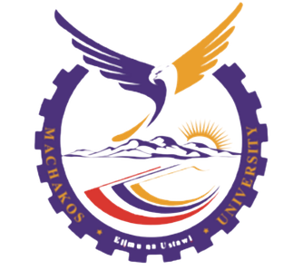

 ## 🎗️ About Me

 👋 Hi there, I’m GeraldOkoth(TechiesKE)
- 💞️ I’m passionate and interested about software development, web development, artificial intelligence and blockchain technologies.
- 🫠I’m currently pursuing bachelor's degree in mathematics and computer science at [Machakos University](https://mksu.ac.ke "Machakos University home")
- 👩‍💻 I’m looking forward to collaborate on GitHub code spaces with fellow tech-enthusiasts.
- 💻I am currently learning programming languages with the aid of [W3Schools](https://www.w3schools.com/ "w3Schools home page")
- 💬Ask me about my friends and you will know who i am.😁
- 💫 Check out my [portfolio Website](https://geraldokoth.github.io/PortfolioWeb/ "Gerald Okoth home page")

## 📝Skills
1. Web development
   +  HTML5, CSS, JavaScript, TypeScript
2. Version Control System
   + Git and GitHub
3. Others
   +  C, C++, C#, Java, PHP, MySQL, Kotlin, VB.NET, Ms Access

## 👪Social links
- 📫 Connect with me on [whatsApp](https://wa.me/+254778852760), [github](https://github.com/GeraldOkoth), [linkedin](https://www.linkedin.com/in/geraldokoth/), [twitter](https://twitter.com/gerald_okothKE), [instagram](https://www.instagram.com/okothgerald449/), [facebook](https://www.facebook.com/gerald.okoth.944/), [youtube](https://www.youtube.com/channel/UChy4EZwoIv-KG0hFugqUXYA)

***
## Quote
> There are only __10__ types of people in the world: those who understand __binary__ and those who don't. ~ *Anonymous*
## GitHub Stats
  

<!---
GeraldOkoth/GeraldOkoth is a ✨ special ✨ repository because its `README.md` (this file) appears on your GitHub profile.
You can click the Preview link to take a look at your changes.
--->
